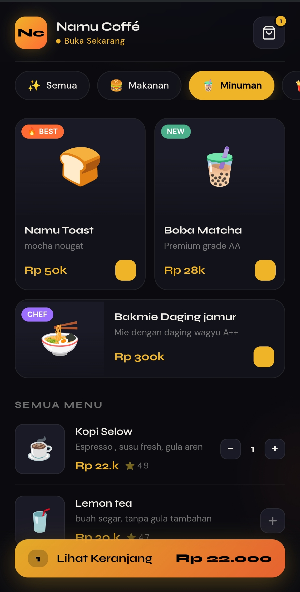
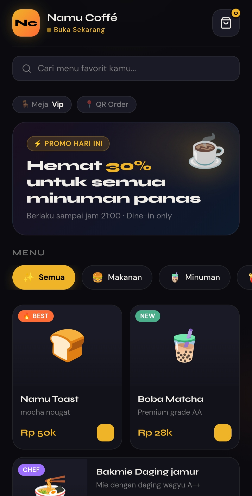

# 🍽️ Menu Resto - Web App

Website menu restoran sederhana yang dibuat menggunakan HTML, CSS, dan JavaScript.  
Project ini dibuat untuk latihan sekaligus portfolio.

## 🚀 Demo
👉 https://xxayii.my.id  
(atau nanti link GitHub Pages kalau udah aktif)

<br>
## 📸 Preview

<p align="center">
  
  
  
</p>
<br>

## 🛠️ Tech Stack
- HTML
- CSS
- JavaScript

## ✨ Fitur
- Tampilan menu restoran modern
- Responsive (bisa dibuka di HP & desktop)
- UI clean & simple
- Mudah dikembangkan

## 📂 Struktur Project

## 📦 Cara Pakai
1. Clone repo ini
```bash
git clone https://github.com/xxayii57/menu-resto.git
